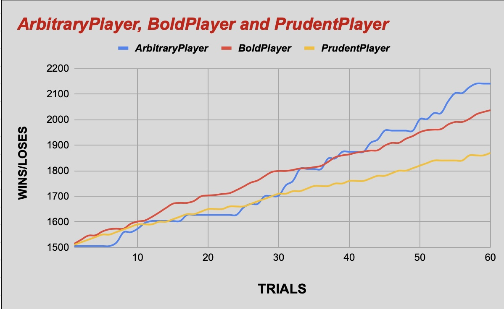

# 2023F CS2910 Project Report
**Chizurum Ewelike 340157**

# Summary of Game
_Monopoly is a timeless board game where the goal is to accumulate wealth by strategically buying, selling, 
and trading properties. In this implementation, players use various strategies, such as arbitrary, bold, or prudent, to
influence their decisions and movements. In order to demonstrate the effects of various playing styles on the game, 
the experiment evaluates each strategy's performance across 60 trials, which aims to identify the player approach 
that wins the most games. Unlike the original game's rules, players do not necessarily need to bankrupt opponents to win, 
and the bold player is considered the strongest. 

**Link to original game** - https://www.monopolygo.com_

# Experiment Report
## Player Strategies
1. Strategy 1~ Arbitrary Strategy: Arbitrary Strategy: The Arbitrary Player (random player) uses a random approach, moving
   between 1 and 6 spaces based on the roll of a six-sided die. With a 50 percent probability, the player acquires 
   properties on new spaces, introducing an unpredictable element to the game. This strategy keeps opponents guessing 
   and may lead to varied outcomes in different game instances._ 
                                                           

2. Strategy 2~ Bold Strategy: The Bold Player (aggressive player) uses an aggressive approach, prioritizing rapid
   property acquisition and taking calculated risks. The player moves a variable number of spaces with a 90 percent
   chance of buying properties on new spaces. This daring strategy aims for dominance by accumulating valuable assets  
   quickly. The bold player is considered to be the strongest player among
  other players._
                                   

3. Strategy 3~ Prudent Strategy: The Prudent Player (cautious player) uses a cautious and calculated strategy,
   consistently moving one space per turn. When landing on new spaces, the player buys properties with a 30 percent
   chance, focusing on steady progress and long-term stability. This risk-averse approach aims to build a reliable 
   portfolio over time, offering a strategic contrast to more aggressive players._

## Procedure
_The goal of this experiment is to assess and contrast three different player approaches in a mock Monopoly game.
As part of the setup, instances of players with unique strategies are created, and their performance is monitored 
through a series of trials. The main class coordinates the game simulations and keeps track of the results, which helps
to facilitate the experiment._

First, three proven player strategies are identified.

1. Arbitrary Player: In this method, players move randomly and have a 50 percent chance of purchasing a property when they
land in a new area.
                   

2. BoldPlayer: An aggressive approach with a 90 percent possibility of purchasing a property upon entering a new area, 
requiring more substantial measures.
                   

3. PrudentPlayer: A cautious strategy that always moves one space and has a 30 percent chance of buying a property.

The Main class initializes these players, conducts a specified number of trials, which is 60 in this case, and records
the number of wins for each strategy. Each trial involves running a Monopoly game with shuffled players and determining 
the winner based on the accumulated wealth, where the player with the highest total wealth, considering both money and 
the value of properties, is declared the winner of that particular trial.
The data collected includes the number of wins for each player strategy across the trials. This information is essential
for evaluating the effectiveness of each strategy in winning the game. The results are then printed to the console, 
providing a summary of the experiment outcomes._

## Results
**Image:**

**Table:**

| Trials | ArbitraryPlayer | BoldPlayer | PrudentPlayer |
|--------|-----------------|------------|---------------|
| 1      | 1505            | 1514       | 1510          |
| 2      | 1505            | 1530       | 1520          |
| 3      | 1505            | 1546       | 1530          |
| 4      | 1505            | 1547       | 1540          |
| 5      | 1505            | 1562       | 1550          |
| 6      | 1505            | 1571       | 1550          |
| 7      | 1519            | 1573       | 1560          |
| 8      | 1559            | 1573       | 1570          |
| 9      | 1559            | 1592       | 1580          |
| 10     | 1573            | 1601       | 1590          |
| 11     | 1595            | 1605       | 1590          |
| 12     | 1603            | 1619       | 1590          |
| 13     | 1603            | 1636       | 1600          |
| 14     | 1603            | 1654       | 1600          |
| 15     | 1603            | 1671       | 1610          |
| 16     | 1603            | 1674       | 1620          |
| 17     | 1627            | 1674       | 1630          |
| 18     | 1627            | 1682       | 1630          |
| 19     | 1627            | 1700       | 1640          |
| 20     | 1627            | 1703       | 1650          |
| 21     | 1627            | 1705       | 1650          |
| 22     | 1627            | 1709       | 1650          |
| 23     | 1627            | 1712       | 1660          |
| 24     | 1627            | 1724       | 1660          |
| 25     | 1656            | 1738       | 1660          |
| 26     | 1670            | 1753       | 1670          |
| 26     | 1670            | 1762       | 1680          |
| 28     | 1700            | 1779       | 1690          |
| 29     | 1700            | 1795       | 1700          |
| 30     | 1703            | 1799       | 1710          |
| 31     | 1743            | 1799       | 1710          |
| 32     | 1760            | 1803       | 1720          |
| 33     | 1807            | 1809       | 1720          |
| 34     | 1807            | 1810       | 1730          |
| 35     | 1807            | 1814       | 1740          |
| 36     | 1807            | 1819       | 1740          |
| 37     | 1848            | 1835       | 1740          |
| 38     | 1848            | 1853       | 1750          |
| 39     | 1874            | 1860       | 1750          |
| 40     | 1874            | 1864       | 1760          |
| 41     | 1874            | 1871       | 1760          |
| 42     | 1874            | 1875       | 1760          |
| 43     | 1909            | 1879       | 1770          |
| 44     | 1922            | 1880       | 1780          |
| 45     | 1957            | 1898       | 1780          |
| 46     | 1957            | 1909       | 1790          |
| 47     | 1957            | 1909       | 1800          |
| 48     | 1957            | 1925       | 1800          |
| 49     | 1957            | 1936       | 1810          |
| 50     | 2002            | 1951       | 1820          |
| 51     | 2002            | 1959       | 1830          |
| 52     | 2026            | 1961       | 1840          |
| 53     | 2026            | 1963       | 1840          |
| 54     | 2072            | 1981       | 1840          |
| 55     | 2104            | 1991       | 1840          |
| 56     | 2104            | 1991       | 1840          |
| 57     | 2127            | 2003       | 1860          |
| 58     | 2141            | 2021       | 1860          |
| 59     | 2141            | 2030       | 1860          |
| 60     | 2141            | 2037       | 1870          |

## Analysis

Results Interpretation

ArbitraryPlayer utilizes random moves and has a 50% chance of buying a property upon landing in a new space, and it
rarely secures a win. BoldPlayer consistently outperforms other strategies with aggressive moves and a high probability
of property acquisition, winning 59 out of 60 trials. PrudentPlayer, adopting a cautious approach, secures only one win,
lagging behind BoldPlayer overall.
Conclusion
The results strongly suggest that the **BoldPlayer strategy**, characterized by bold and aggressive moves and a 
high inclination to acquire properties, is better in the Monopoly game compared to the other strategies. 
This interpretation is grounded in the observed patterns of wealth accumulation and the number of wins and losses 
across the 60 trials. The BoldPlayer's consistent dominance in the outcomes indicates the robust effectiveness of this 
strategy in the simulated Monopoly scenario._ 

Table & XY plot interpretation:

The XY plot vividly illustrates how each player's strategy performed throughout the trials. As we analyze the plot's 
trends, it becomes a revealing storybook, showing us how different approaches fared in this Monopoly simulation. 
BoldPlayer, known for its aggressive gameplay, shows a steep upward curve—a testament to its daring, high-risk moves
that resulted in frequent wins. Meanwhile, PrudentPlayer and ArbitraryPlayer, employing more cautious and randomized 
strategies, respectively, showcase flatter curves, indicating steadier but less aggressive wealth accumulation.
PrudentPlayer's conservative tactics reflect a balanced rise in wealth, balancing risk aversion with strategic
property acquisitions, while ArbitraryPlayer's erratic trajectory highlights the unpredictability of random
decision-making._
As the trials progressed, the wins and losses for each strategy became clearer and increased due to mastering the game. 
The XY plot is not just a visual representation; it is a tale of strategic choices and their impact as the number of 
trials increases. BoldPlayer shines as a dominant force, while PrudentPlayer and ArbitraryPlayer present contrasting 
styles with unique strengths and limitations. This analysis through evolving trends deepens our understanding of how the
different strategies interacted with success in this simulated Monopoly scenario. 
